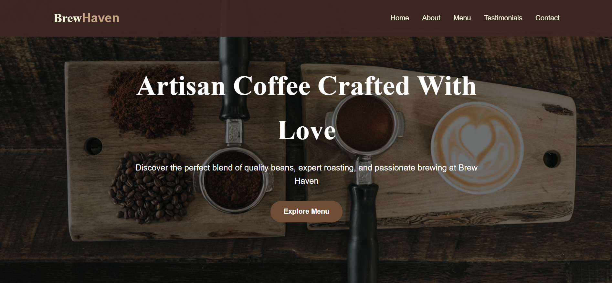
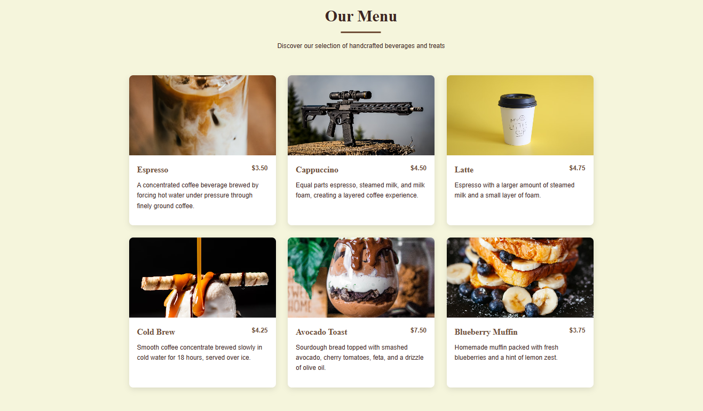
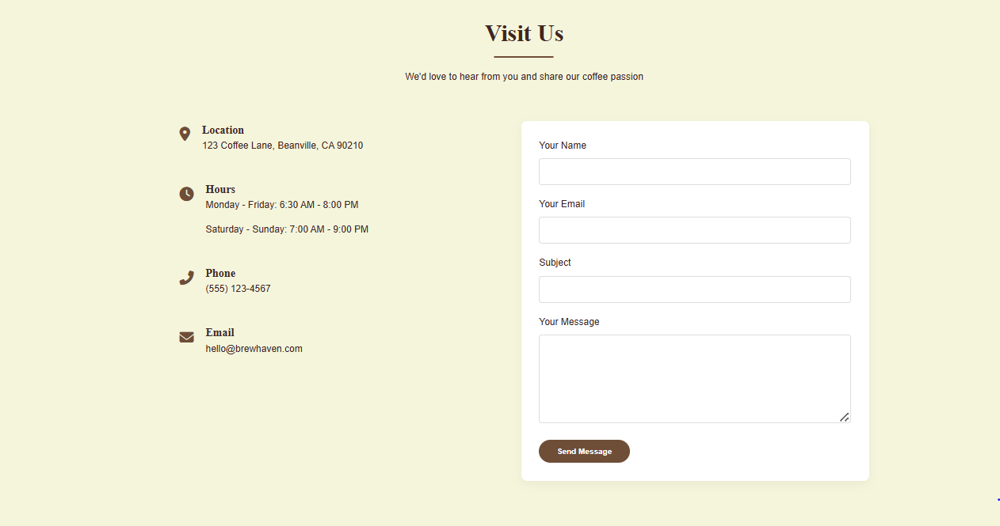

# ☕ Coffee Corner - A Modern Coffee Shop Website

Welcome to *Coffee Corner, a modern, responsive, and visually appealing coffee shop website built using **HTML, CSS, and JavaScript*. This website showcases coffee products, daily offers, and contact information to attract customers and enhance brand identity.

---

## 🖼 Preview

### ☕ Homepage

### 📜 Menu Section

### 📍 Contact Section

## 🚀 Features

- 📱 Fully responsive layout (mobile-first design)
- 🧾 Interactive menu with product categories
- 🕑 Opening hours and location section
- 📧 Contact form (with email or dummy action)

## 🛠 Built With

- ✅ HTML5  
- ✅ CSS3 (Flexbox / Grid / Animations)
- ✅ JavaScript (DOM, Events)
